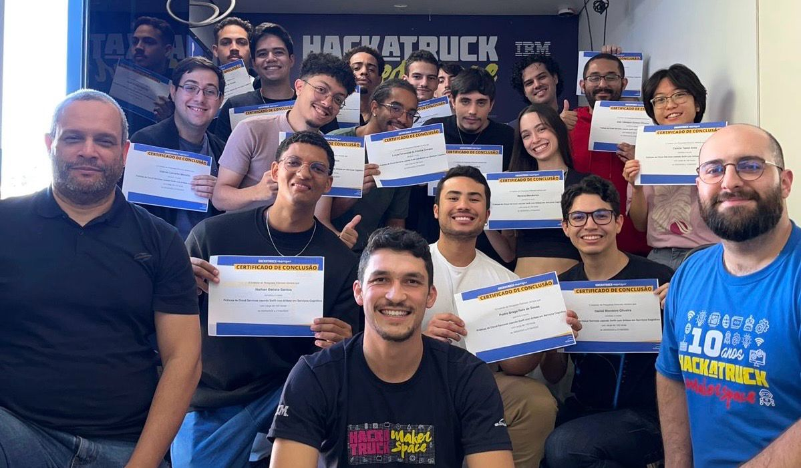

# HackaTruck 🚛

Este repositório reúne parte dos códigos e imagens que desenvolvi durante minha participação no HackaTruck, um programa educacional itinerante focado em tecnologia, inovação e desenvolvimento de aplicativos.

O projeto teve duração de um mês e foi realizado utilizando a linguagem Swift, da Apple. As atividades aconteceram dentro de um caminhão tecnológico, totalmente equipado com computadores e recursos para aprendizado prático.

Durante esse período, aprendi e pratiquei conceitos essenciais de programação para iOS, trabalhando em desafios reais e criando soluções visuais e funcionais.

Foi uma experiência incrível, que uniu teoria e prática, ampliou minhas habilidades técnicas e reforçou minha paixão por tecnologia.

